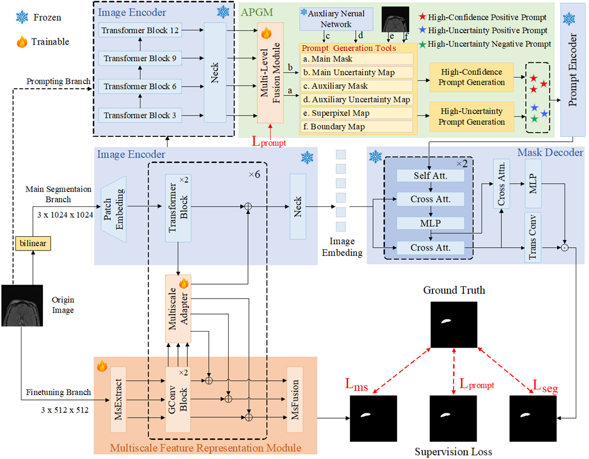

# SAM-AdaM: Segment Anything Model with Adaptive Prompting and Multiscale Finetuning for Head-and-Neck Tumor Segmentation

We propose SAM-AdaM, a novel framework for HNT segmentation that integrates three synergistic components. The Main Segmentation Branch, built upon SAM (ViT-B), performs the core segmentation task. The Finetuning Branch enhances predictions by incorporating multiscale feature representation and periodically interacting with the main segmentation branch through a multiscale adapter. Meanwhile, the Prompting Branch leverages outputs from both the SAM model and a lightweight segmentation model to adaptively generate high-confidence and high-uncertainty prompts, thereby further improving segmentation performance. Collectively, these branches form a cohesive and adaptive system optimized for precise HNT segmentation.


## Get started

### Installation

Make sure [conda](https://www.anaconda.com/distribution/) is installed properly.

```bash
# Clone this repo
git clone https://github.com/jia9599/DawnNet.git
cd DawnNet
```
```bash
# Create a conda environment
conda create -n dawnnet python=3.8.20

# Activate the environment
conda activate dawnnet

# Install dependencies
pip install -r requirements.txt
```